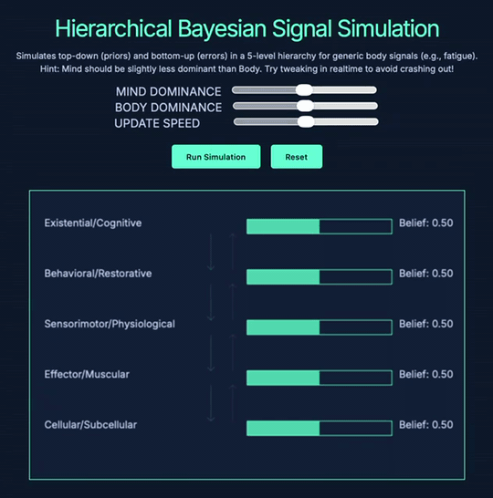

# Friston-like Simulator — Hierarchical Bayesian Signal Simulation

<p align="center">
  
</p>

A compact, interactive browser simulation of hierarchical Bayesian (predictive coding) dynamics inspired by Karl Friston's predictive processing ideas. It visualizes how top‑down priors and bottom‑up sensory errors interact across a 5‑level hierarchy (from cellular through cognitive) and lets you tune the relative influence of "mind" (priors) and "body" (sensory noise) in real time.

Exported from CodePen by Josiah Rhys Jacobson (with AI assistance).

## Key ideas
- Top-down signals = priors (expectations) that modulate lower levels.
- Bottom-up signals = sensory errors that update beliefs upward.
- The UI visualizes belief bars at each level and flashing arrows for information flow.

## Features
- Real-time interactive simulation rendered to an HTML5 canvas.
- Three sliders to control model behavior: mind dominance (prior bias), body dominance (noise), and update speed (learning rate).
- Visual indicators for top‑down and bottom‑up propagations and simple "glitch" effects when simulated stress thresholds are exceeded.
- Single-file client implementation (index.html + script.js + style.css) — easy to fork and modify.

## Relevant files
```
index.html         — Minimal HTML UI and canvas hook-ups
script.js          — Simulation logic, drawing, controls, main loop
style.css          — Styling, layout, and visual glitch effects
```

## Quick demo (local)
1. Clone the repository:
   git clone https://github.com/jj2025-archive/friston-simulation.git
2. Serve the files (recommended — some browsers restrict canvas/script behavior on file://):
   - Python 3:
     python -m http.server 8000
     then open http://localhost:8000
   - Or use a static server:
     npx serve .
   - Or open index.html directly in a modern browser (Chrome/Edge/Firefox).

## How to use the UI
- MIND DOMINANCE (priorBias slider): 0 = priors highly attend/amplify bottom‑up errors; 1 = priors strongly suppress bottom‑up signals. (Label in code: `priorBias`)
- BODY DOMINANCE (noiseLevel slider): Controls sensory noise injected at the lowest (cellular) level. (Label in code: `noiseLevel`)
- UPDATE SPEED (learningRate slider): How quickly beliefs update in response to prediction errors and priors. (Label in code: `learningRate`)
- Run Simulation / Reset: `Run Simulation` starts/updates the simulation using current slider values. `Reset` restores defaults and clears accumulated stress.

## What you'll see in the canvas
- Five horizontal "belief" bars representing:
  1. Existential/Cognitive
  2. Behavioral/Restorative
  3. Sensorimotor/Physiological
  4. Effector/Muscular
  5. Cellular/Subcellular
- Downward teal arrows = top‑down priors influencing lower levels.
- Upward pink arrows = bottom‑up prediction errors.
- If accumulated "bodyStress" or "mindStress" exceed the threshold, the canvas performs a glitch effect and an alert is shown:
  - "Body Crash: Overwhelming somatic errors!"
  - "Mind Overload: Excessive cognitive suppression!"

## How it works (implementation notes)
- Main loop: `simulateStep()` in `script.js` runs roughly at `FPS = 45`, injecting bottom‑up noise at the base level and propagating errors upward, then applying priors downward.
- Data model: `levels` array (5 objects with `name`, `y`, `belief`, `prior`).
- Bottom‑up update: error = child.belief − parent.prior; update scaled by `learningRate * precision` where `precision` = 1 − priorBias.
- Top‑down update: each level’s `prior` is computed from the level above and mixed into its `belief` using `priorBias` and `learningRate`.
- Stress accumulators (`bodyStress`, `mindStress`) are increased each frame based on noise, prior bias and update magnitudes, and compared to `STRESS_THRESHOLD` to trigger failure visuals.